# Improving Eval Profitability in `crypto_rl`

## Goal Description

The agent currently fails to beat a simple buy-and-hold baseline on the test set
(buy-hold ≈ $102.50 vs. agent ≈ $97–$100). The run history also reveals two
extreme failure modes: **policy collapse to all-HOLD** (0 trades, $100.00
portfolio) and **fee-drain loops** ($15–$73 portfolio with 1940 profitable-but
tiny sell cycles). Hyperparameter tuning of the PPO knobs alone (LR, clip, steps,
entropy) has been unstable because the root causes lie **upstream** of PPO, in
the environment design, reward signal, data pipeline, and evaluation methodology.

This plan is structured as a **priority-ordered backlog** — highest-value,
lowest-risk items first — with background theory, concrete code diffs, and a
verification strategy for each tier.

---

## Diagnosis: What the Run Log Tells Us

| Pattern in logs | Root cause |
|---|---|
| `final_pv ≈ 100.00`, 0 trades | Reward landscape pushes Hold as dominant strategy (hold_cost barely hurts, exploration collapses) |
| `final_pv ≈ 15–73`, 1940 trades, 100% win_rate | `profit_bonus` reward-hacks: agent discovers micro-sell cycles that earn shaped reward but destroy capital via fees |
| `final_pv ≈ 97–99`, 1–3 trades | Under-trained policy with no useful signal learned |
| Buy-hold always beats agent | Train-set features don't transfer to test set; reward not aligned with end-goal (terminal wealth) |

---

## User Review Required

> [!IMPORTANT]
> **Scope clarification**: This plan is a **research roadmap**, not a single PR.
> It proposes 5 tiers of work. Please decide how far you want to go: implementing
> **Tier 1–2 alone** will already substantially stabilise results; Tiers 3–5 push
> toward serious competitive performance but require more effort. You can approve
> any subset of tiers.

> [!WARNING]
> **No breaking changes to the CLI** are introduced by any of these tiers: all new
> hyper-parameters get sensible defaults, and existing `scripts/run_medium.sh`
> continues to work. However, **reward magnitudes will change** across tiers; saved
> models from before Tier 1 will behave erratically if loaded after.

> [!CAUTION]
> **Optuna** is already installed (`requirements.txt`). Tier 2 uses it for
> automatic hyper-parameter search. Running a full search requires several hours of
> wall-clock time; a lightweight smoke-test search (10 trials × 20k steps) takes
> ~5–10 minutes.

---

## Open Questions

> [!IMPORTANT]
> 1. **GPU available?** `main.py` uses `device="cpu"`. The machine has CUDA
>    packages installed (`requirements.txt`). Switching to `device="cuda"` would
>    speed up Tier 3–5 training by 5–20×. Should we enable this?
> 2. **Target metric**: should we optimise for (a) highest mean terminal portfolio
>    value, (b) Sharpe ratio, or (c) outperforming buy-and-hold by the largest
>    margin? The reward function changes in Tier 1 differ based on this.
> 3. **Data freshness**: the parquet file covers 4 years. Do you want the agent to
>    train on the most recent 6 months only (recency bias) or on all 4 years
>    (diversity)? This affects the data-loading strategy in Tier 3.

---

## Proposed Changes

---

### Tier 1 — Fix the Foundation (High Priority, Low Risk) ✅

These changes alone are likely to double eval stability. They eliminate the two
failure modes seen in the run logs.

---

#### 1A — Reward Hacking Fix: Decouple `profit_bonus` from `realised_pnl` magnitude

**Background**: `profit_bonus * realised_pnl` scales with trade size, so the
agent discovers that many small sells (with the shaped bonus) generate more
cumulative reward than a single large profitable hold — even if fees destroy
capital. This is a classic reward-hacking / Goodhart's-law failure.

**Fix**: replace the raw-PnL bonus with a binary "did this sell beat a hurdle
rate?" incentive, capped so it cannot exceed the actual portfolio gain.

```diff
# env.py  ~line 400
- if realised_pnl > 0:
-     reward += realised_pnl * self.profit_bonus
-     if not self.is_eval:
-         reward += self.trade_freq_incentive * amount_pct
+ if realised_pnl > 0 and is_valid_sell:
+     # Binary bonus: reward only if PnL exceeds fee threshold (> 0.2% hurdle)
+     hurdle = self.avg_entry_price[asset_idx] * trade_units * 0.002
+     if realised_pnl > hurdle:
+         reward += self.profit_bonus  # flat, not scaled by PnL magnitude
```

Default `profit_bonus` stays 0.15; `trade_freq_incentive` is removed (it's
redundant once the binary bonus is in place and was amplifying the fee-drain bug).

---

#### 1B — Terminal Reward: Add a sparse end-of-episode portfolio return bonus

**Background**: PPO with `gamma=0.99` over a 5700-step episode (80% of 10k/5
assets) discounts step-101 reward to only 0.01 of its nominal value. The policy
therefore ignores long-horizon portfolio growth entirely and focuses on immediate
shaping signals. A terminal bonus bypasses discounting.

```diff
# env.py  step()
  done = self.current_step >= len(self.prices_df)
+ if done:
+     terminal_return = (self.portfolio_value - BUDGET_INITIAL) / BUDGET_INITIAL
+     # Scale: +1.0 bonus for +10% return, -0.5 penalty for -5% loss
+     reward += terminal_return * 10.0
```

> [!TIP]
> This single change is the most impactful thing in the entire plan for long-run
> profitability. Terminal rewards are the standard approach in finance RL
> (see FinRL, DeepLOB papers).

---

#### 1C — Observation normalisation: fix the z-score anchor

**Background**: the current code anchors `vol_mean` / `mom_mean` to the
**initial window** of the episode and never updates it. If the episode starts in a
calm period and encounters a volatile crash, all volatility features saturate.

**Fix**: use a rolling normalisation computed at every step:

```diff
# env.py  _get_obs()
- volatility = (volatility - self.vol_mean) / (self.vol_std + 1e-8)
- momentum  = (momentum  - self.mom_mean) / (self.mom_std + 1e-8)
+ # Normalise within the current window instead of using a stale episode anchor
+ volatility = (volatility - volatility.mean()) / (volatility.std() + 1e-8)
+ momentum   = (momentum  - momentum.mean())   / (momentum.std()  + 1e-8)
```

---

#### 1D — Hold-cost recalibration

**Background**: hold_cost is charged as `current_asset_value * 0.0001` per step.
At 1-minute bars this is 0.01%/minute = 6%/hour — catastrophically large and
forcing the agent to never hold. The trading fee is 0.1%, so the break-even time
for a position is only 1 minute.

**Fix**: set `hold_cost_rate` to near-zero by default and expose it clearly:

```diff
# cli.py
- default=0.0001,
+ default=0.000001,   # 0.0001% per step — 600× smaller
+ help="Hold cost rate per step. Default 1e-6 (≈ 0.05%/day for 1-min bars)."
```

---

### Tier 2 — Hyperparameter Stability via Automated Search (Medium Priority)

**Background**: Manual tuning of 10+ PPO knobs on a noisy signal is why results
were "unstable". Optuna with a simple sampler will find good regions far more
reliably than manual grid search.

#### [NEW] `scripts/optuna_search.py`

```python
"""
Automated hyper-parameter search using Optuna.
Usage:
    python scripts/optuna_search.py --n-trials 20 --rows 10000 --timesteps 30000
"""
import optuna, subprocess, json, sys, argparse

def objective(trial):
    lr  = trial.suggest_float("lr",  1e-4, 5e-3, log=True)
    ent = trial.suggest_float("ent", 1e-3, 0.05, log=True)
    gamma = trial.suggest_float("gamma", 0.90, 0.999)
    n_steps = trial.suggest_categorical("n_steps", [512, 1024, 2048])
    clip    = trial.suggest_float("clip", 0.1, 0.4)
    pb  = trial.suggest_float("profit_bonus", 0.05, 0.5)

    cmd = [
        sys.executable, "main.py",
        "--rows", "10000", "--timesteps", "30000",
        "--learning-rate", str(lr),
        "--ent-coef", str(ent),
        "--gamma", str(gamma),
        "--n-steps", str(n_steps),
        "--clip-range", str(clip),
        "--profit-bonus", str(pb),
        "--no-dashboard",
    ]
    result = subprocess.run(cmd, capture_output=True, text=True)
    for line in result.stdout.splitlines():
        if "Final Test Portfolio Value" in line:
            return float(line.split("$")[1])
    return 100.0  # no-trade baseline

if __name__ == "__main__":
    p = argparse.ArgumentParser()
    p.add_argument("--n-trials", type=int, default=20)
    args = p.parse_args()
    study = optuna.create_study(direction="maximize",
                                 storage="sqlite:///optuna.db",
                                 study_name="crypto_rl_v1",
                                 load_if_exists=True)
    study.optimize(objective, n_trials=args.n_trials, n_jobs=1)
    print("Best params:", study.best_params)
    print("Best value:", study.best_value)
```

> [!NOTE]
> `--no-dashboard` requires a one-line addition to `cli.py` (flag already
> partially present; `default=True` needs to be switchable to `False`).

---

### Tier 3 — Data & Observation Quality (Medium Priority)

#### 3A — Multi-episode training windows (curriculum randomisation)

**Background**: `read_last_n` picks **one** random contiguous window and then
the agent sees the exact same price sequence every episode. The agent effectively
**memorises** the training sequence and cannot generalise.

**Fix**: wrap the environment in a `reset()` that re-samples a new random window
each episode from the full parquet file.

```diff
# env.py — add to __init__
+ self.parquet_path: str | None = None  # set by caller to enable re-sampling
+ self.n_rows: int = 0

# env.py — add to reset()
+ if self.parquet_path:
+     from crypto_rl.data import read_last_n
+     new_df = read_last_n(self.parquet_path, n=self.n_rows)
+     self.prices_df = new_df.pivot(index="open_time", columns="symbol", values="close")

# main.py
+ train_env.parquet_path = args.dataset
+ train_env.n_rows = args.rows
```

This prevents overfitting to a single market regime and is likely the single
biggest generalisation improvement.

#### 3B — Richer observations: RSI + MACD [IMPLEMENTED]

The current feature vector has been updated to include RSI and MACD features (+ 2 * num_assets). The implementation computes these indicators per-step for each asset over the observation window:

- **RSI** is calculated via price deltas and scaled to `[-1, 1]`.
- **MACD** is represented as the difference between the 3-step moving average and the overall window mean, normalized by the window's standard deviation.

The environment's `obs_dim` and `observation_space` are fully updated and verified to train cleanly.

#### 3C — Train/test split: use a fixed held-out period, not a random fraction

**Background**: the current split is `iloc[:split_idx]` / `iloc[split_idx:]`
within a single random window. If `data_seed=42` always picks the same window,
train and test are always adjacent — the model may bleed information across the
boundary.

**Fix**: hardcode a calendar split:

```python
# data.py — new function
def read_train_test(path, n_train, n_test):
    """Return (train_df, test_df) with non-overlapping time windows."""
    df = read_last_n(path, n=n_train + n_test)
    # Use last n_test rows as held-out set, always
    split = len(df["open_time"].unique()) - n_test // len(DEFAULT_SYMBOLS)
    times = sorted(df["open_time"].unique())
    cut = times[split]
    return df[df["open_time"] < cut], df[df["open_time"] >= cut]
```

---

### Tier 4 — Architecture & Algorithm Improvements (Lower Priority)

#### 4A — Switch from MultiDiscrete to a better action representation

**Background**: `MultiDiscrete([3, 5, 101])` creates 1515 equally-weighted
actions. Gradient is wasted on learning that `amount_pct=0` and `action_type=BUY`
is the same as HOLD. A **Flat Discrete** or **continuous action space** removes
this.

Option 1 — flat integer: `Discrete(3 * num_assets * 5)` where amount_pct becomes
5 buckets (0%, 25%, 50%, 75%, 100%). Reduces wasted gradient.

Option 2 — continuous: `Box(low=-1, high=1, shape=(num_assets,))` where the sign
encodes direction and magnitude encodes amount. Requires switching from PPO to SAC
(already available via `sb3_contrib`).

> [!NOTE]
> Continuous action (SAC) is often better for portfolio allocation tasks. SB3 SAC
> can be enabled with a 2-line change to `main.py` since `sb3_contrib` is already
> installed.

#### 4B — Recurrent policy (LSTM) for regime awareness

SB3's `RecurrentPPO` from `sb3_contrib` replaces `MlpPolicy` with an LSTM that
retains a hidden state across steps — critical for remembering entry price context
across a 5000-step episode.

```diff
- from stable_baselines3 import PPO
+ from sb3_contrib import RecurrentPPO as PPO  # drop-in replacement
  model = PPO("MlpLstmPolicy", train_env, ...)
```

#### 4C — Larger network with batch normalisation

```diff
  policy_kwargs={
-     "net_arch": dict(pi=[128, 128], vf=[128, 128]),
+     "net_arch": dict(pi=[256, 256, 128], vf=[256, 256, 128]),
      "activation_fn": torch.nn.ReLU,
+     "normalize_images": False,  # not images
  }
```

---

### Tier 5 — Evaluation Methodology (Essential for Measuring Progress)

Without proper evaluation, you cannot tell whether a change helped or hurt.

#### [MODIFY] `main.py` — multi-seed evaluation

**Background**: a single eval run on one random data window has high variance.
Reporting the mean ± std over 5 seeds is standard in RL research.

```python
# Add after training loop
eval_returns = []
for seed in range(5):
    np.random.seed(seed)
    eval_df = read_last_n(args.dataset, n=args.rows)
    test_df = eval_df.iloc[int(len(eval_df)*0.8):]
    env = MinimalCryptoEnv(test_df, ..., is_eval=True)
    obs, _ = env.reset()
    done = False
    while not done:
        action, _ = model.predict(obs, deterministic=True)
        obs, _, done, _, _ = env.step(action)
    eval_returns.append(env.portfolio_value)
    env.close()
print(f"Eval PV  mean={np.mean(eval_returns):.2f}  std={np.std(eval_returns):.2f}  min={np.min(eval_returns):.2f}")
```

#### [NEW] `scripts/eval_report.py` — Sharpe, Sortino, Max Drawdown

```python
"""Compute finance metrics from a saved JSONL action log."""
import json, numpy as np, sys

pv_series = [e["portfolio"] for e in map(json.loads, open(sys.argv[1]))]
returns = np.diff(pv_series) / np.array(pv_series[:-1])
sharpe  = returns.mean() / (returns.std() + 1e-8) * np.sqrt(1440)  # annualised at 1-min
downside = returns[returns < 0]
sortino  = returns.mean() / (downside.std() + 1e-8) * np.sqrt(1440)
peak = np.maximum.accumulate(pv_series)
dd   = (np.array(pv_series) - peak) / peak
print(f"Sharpe={sharpe:.2f}  Sortino={sortino:.2f}  MaxDD={dd.min()*100:.1f}%  FinalPV={pv_series[-1]:.2f}")
```

---

## Summary: Priority Order and Expected Impact

```mermaid
graph LR
    T1A["1A: Fix profit_bonus\nhacking"] --> T1B
    T1B["1B: Terminal reward\nbonus"] --> T1C
    T1C["1C: Rolling obs\nnormalisation"] --> T1D
    T1D["1D: Hold-cost\nrecalibration"] --> T2
    T2["Tier 2: Optuna search\n(auto HP tuning)"] --> T3
    T3["Tier 3: Random window\nresampling + RSI/MACD"] --> T4
    T4["Tier 4: SAC or\nRecurrentPPO"] --> T5
    T5["Tier 5: Multi-seed eval\n+ finance metrics"]
    
    style T1A fill:#d4edda
    style T1B fill:#d4edda
    style T1C fill:#d4edda
    style T1D fill:#d4edda
    style T2 fill:#fff3cd
    style T3 fill:#fff3cd
    style T4 fill:#f8d7da
    style T5 fill:#cce5ff
```



| Tier | Changes | Est. Impact | Risk | Effort |
|------|---------|-------------|------|--------|
| **1A** | Fix `profit_bonus` hacking | Eliminates fee-drain collapse | Very low | 10 min |
| **1B** | Terminal portfolio reward | +$2–8 typical gain | Very low | 10 min |
| **1C** | Rolling obs normalisation | Smoother training | Very low | 5 min |
| **1D** | Hold-cost recalibration | Eliminates all-HOLD collapse | Very low | 2 min |
| **2** | Optuna HPO | Stable, reproducible best params | Low | 2–4 hours |
| **3A** | Episode window resampling | Biggest generalisation gain | Medium | 30 min |
| **3B** | RSI + MACD features | Better directional signal | Low | 20 min |
| **3C** | Calendar train/test split | Unbiased eval | Low | 15 min |
| **4A** | Flat discrete / SAC | Better policy gradient | Medium | 1 hr |
| **4B** | RecurrentPPO | Regime memory | Medium | 30 min |
| **4C** | Larger network | Better capacity | Low | 5 min |
| **5** | Multi-seed eval + metrics | Trustworthy measurement | Very low | 30 min |

---

## Verification Plan

### After Tier 1 (the most critical)

```bash
# Baseline sanity run — expect no all-HOLD or fee-drain collapses
python main.py --rows 10000 --timesteps 30000 --dashboard

# Confirm hold-cost change has no effect on 0-trade runs
python main.py --rows 10000 --timesteps 5000 --hold-cost-rate 0.000001
```

**Manual checks**:
- `final_pv` should be ≥ $100.00 in ≥ 70% of runs (vs. ≤ 30% today)
- Runs with `0 trades` should drop to < 20% of all runs
- No run should have `final_pv < $90`

### After Tier 2

```bash
python scripts/optuna_search.py --n-trials 10 --rows 10000 --timesteps 30000
```

**Expect**: best trial `final_pv ≥ $103`, improved over buy-hold baseline.

### After Tier 3

```bash
# Verify window resampling with multiple data seeds
for seed in 1 2 3 4 5; do
  python main.py --rows 10000 --timesteps 30000 --data-seed $seed
done
# Compute mean/std manually from output
```

### After Tier 5

```bash
python scripts/eval_report.py logs/run-YYYYMMDD-HHMMSS-minimal/actions_eval_ep1_*.jsonl
```
