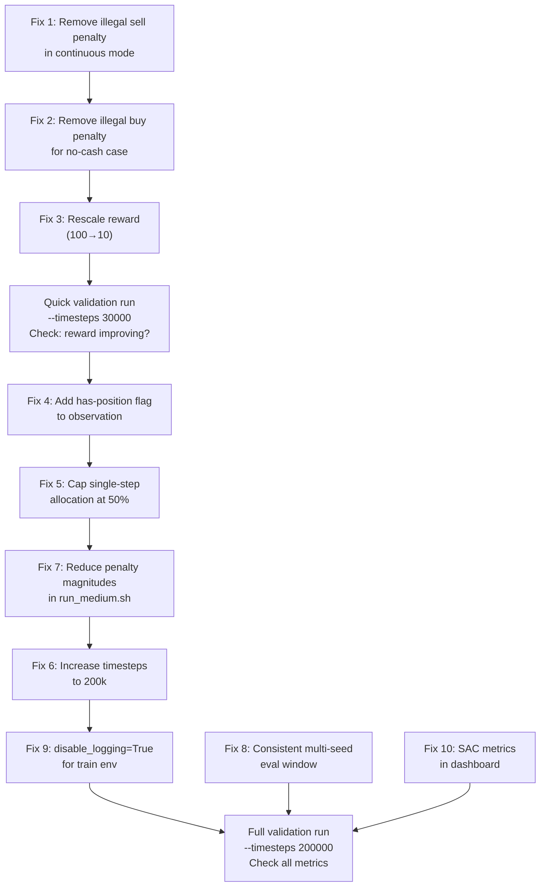

# RL Agent Improvement Plan

## Goal
Diagnose the current crypto RL agent's critical failure modes and implement practical, prioritized fixes to produce a policy that actually learns a trading signal — measured by: positive PnL vs buy-hold, >0% win rate, and stable training reward improvement.

---

## Diagnostic Findings

The run `run-20260722-154652-minimal` used SAC with `--action-space-type continuous` and `--reward-type excess_return`. Here is what the data shows:

### 📊 Key Metrics

| Metric | Value |
|---|---|
| Final test PV | $94.01 (-5.99%) |
| Buy-hold baseline | $100.78 (+0.78%) |
| Eval trades | 3 |
| Win rate | 0% |
| Fees paid | $0.10 |
| Mean training step reward | **-9.6** |
| Training reward (start → end) | -1,496 → -10,838 |
| Assets ever bought (1-buy steps) | ETHUSDT: 100%, others: 0% |

### 🔴 Finding 1 — CRITICAL: Illegal Sell Penalties Dominate the Reward Signal

**This is the root cause of training failure.**

The continuous action space emits per-asset signals $a_i \in [-1, 1]$:
- $a_i > 0.05$: BUY asset $i$ with fraction $a_i$ of cash
- $a_i < -0.05$: SELL asset $i$ with fraction $|a_i|$ of holdings

The agent consistently buys only ETH. For the other 4 assets (BTC, SOL, BNB, XRP), it holds zero units but still outputs negative signals → `illegal_sell_penalty` fires **4 times per step**:

```
illegal_sell_penalty = 0.02 * portfolio_value = 0.02 * 100 = 2.0
4 assets * 2.0 per step = 8.0 penalty per step
```

The `excess_return` signal is only ~±0.5 per step. The penalty-to-signal ratio is **16:1**, making the reward essentially pure noise. The agent **cannot learn**.

### 🔴 Finding 2 — CRITICAL: Asset Fixation / Degenerate Policy

The agent has collapsed to a single fixed behavior:
- **Buy ETHUSDT every step** (100% of single-buy steps, all 2239 of them)
- **Sell everything else every step** (which is illegal since it holds nothing)
- Result: effectively a "hold ETH" strategy, but incurring massive penalties along the way

This is not multi-asset portfolio allocation. The agent has found a local optimum: "just buy ETH and ignore everything else" — but can't even execute this cleanly because of the illegal-sell cascade.

### 🔴 Finding 3 — CRITICAL: Training Reward Never Improves

```
Step 1,200:  reward = -1,496
Step 31,200: reward = -10,461  
Step 60,000: reward = -10,838
```

Cumulative reward is worsening monotonically. The delta per checkpoint oscillates between 0 and -3,475, showing no convergence signal. The model is not learning.

### 🟠 Finding 4 — HIGH: Reward Scale Mismatch

```
excess_return component:  ±0.5 per step (good days ±2)
hold_cost per step:       0.0004 (negligible at 4e-6 rate)
illegal_sell_penalty:     -2.0 per illegal sell
```

Even after eliminating illegal sells, the `excess_return` shaping has a fundamental issue: it rewards beating the **mean of all 5 assets**. An agent holding 100% ETH will have excess return = (ETH - mean) which fluctuates randomly and cannot provide a stable learning signal.

### 🟠 Finding 5 — HIGH: 0% Win Rate / No Real Trading

Over 4,740 eval steps, only 3 trades were closed. No trade was profitable. This is consistent with an agent that doesn't understand when to take profits — partly because profit-taking triggers high fees and the `excess_return` reward doesn't provide clear sell signals.

### 🟡 Finding 6 — MEDIUM: High Multi-Seed Variance

```
Seed 0 (main, 4740 steps): -5.91%
Seed 1 (1140 steps):       -2.57%
Seed 2 (1140 steps):       +3.90%
Seed 3 (1140 steps):       +0.71%
Seed 4 (1140 steps):       +0.16%
```

High variance across market regimes — the policy isn't robust. Seeds 2-4 also use fewer steps (1140 vs 4740), making the comparison unfair.

### 🟡 Finding 7 — MEDIUM: KL/Policy Loss Always Zero in Logs

All policy loss and KL divergence values logged are 0.0 throughout training. This is a SAC logging artifact (these metrics apply to PPO, not SAC), but it obscures policy update quality.

---

## User Review Required

> [!IMPORTANT]
> **The illegal_sell_penalty is the single most damaging issue.** The two viable fixes are (A) eliminate the penalty for sells-with-no-holdings in continuous mode, or (B) switch to the discrete action space which handles this more naturally. I recommend **(A) + environment fix** as the primary change. Please review Fix #1 below.

> [!WARNING]
> **Switching reward type from `excess_return` to `pnl`** changes the optimization objective significantly. `pnl` rewards absolute dollar gains, making the buy-hold strategy naturally competitive. `excess_return` theoretically rewards alpha-generation but is harder to optimize. I recommend keeping `excess_return` but fixing its scale — see Fix #2.

> [!IMPORTANT]
> **The `--hold-cost-rate 0.000004` currently in `run_medium.sh`** is already set to a reasonable level. Do NOT increase it — the previous value of 0.0001 caused the agent to never hold, per the CLI docs.

---

## Open Questions

✅ **Resolved — Compute:** 200k timesteps is acceptable (~35 min/run on CPU). Plan updated accordingly.

✅ **Resolved — Dataset:** ~5 years of 1-minute data is available. The `read_last_n` function already samples random windows from the full parquet, so simply replacing `subset.parquet` with the full 5-year file immediately gives far more diverse training episodes (bull/bear/sideways regimes). Recommended: use the full 5-year file with `--rows 60000` (~1-week windows) for substantially better generalization. More coins can be added after training stabilizes — see [Fix 11 — Larger Dataset](#fix-11--use-full-5-year-dataset-medium) below.

> [!NOTE]
> **Deferred — Multi-seed eval step inconsistency:** Seeds 1-4 only run 1,140 eval steps vs. seed 0's 4,740, because the multi-seed loop samples `n=args.rows` rows and takes only the last 20% — a much shorter window than the main eval split. This must be fixed before multi-seed results can be trusted as a training objective. **Not in scope for this plan; will be addressed separately.**

---

## Proposed Changes

### Priority ordering (highest impact first)

---

### Fix 1 — Remove Illegal Sell Penalty in Continuous Mode (CRITICAL)

**File:** [`crypto_rl/env.py`](file:///home/konstantin/dev/crypto_rl/crypto_rl/env.py)

The continuous action space should not penalize sell signals on empty positions. Instead, it should simply **silently ignore** them — the agent already gets no proceeds and pays no fees; no additional punishment is needed. The existing explicit penalty is what breaks training.

```diff
# env.py ~line 404-406 (continuous sell loop)
 else:
-    # Illegal SELL: no holdings
-    step_penalty += self.illegal_sell_penalty * self.portfolio_value
+    pass  # Silently ignore: no holdings, no proceeds, no fee — agent already gets nothing
```

**Why this is safe:** In the continuous action space, the agent outputs a vector. Selling an unowned asset already has zero economic effect. The penalty only exists to discourage "bad" discrete choices, but in continuous mode it fires whenever the hidden state doesn't match the action (which is extremely common early in training).

**Alternative (also recommended):** Add a dead-zone / clamp in the observation: include a binary per-asset "has position" flag so the policy can learn to not sell empty positions naturally. This is proposed in Fix 4 (observation enrichment).

---

### Fix 2 — Reduce/Rescale Illegal Buy Penalty in Continuous Mode (CRITICAL)

**File:** [`crypto_rl/env.py`](file:///home/konstantin/dev/crypto_rl/crypto_rl/env.py)

Similarly, when `cash <= 1e-9` and agent issues a BUY, the penalty is `0.02 * PV = 2.0`. Since the agent is already 100% invested in ETH with near-zero cash, it issues a BUY signal every step → another 2.0 penalty.

```diff
# env.py ~line 420-422 (continuous buy loop)
 if cash_available <= 1e-9:
-    step_penalty += self.illegal_buy_penalty * self.portfolio_value
-    continue
+    continue  # Silently skip: no cash, nothing to buy
```

---

### Fix 3 — Reward Normalization / Better Scaling (HIGH)

**File:** [`crypto_rl/env.py`](file:///home/konstantin/dev/crypto_rl/crypto_rl/env.py)

The `excess_return` reward scales by `* 100` to convert fraction → percentage-points. But SAC expects rewards in a stable range (ideally ~[-1, 1]). The fee-driven PnL component is on a completely different scale.

**Proposed change:** Normalize reward to unit scale by dividing by portfolio value, making all components comparable:

```python
# In the excess_return branch:
reward = (portfolio_return - market_return) * 10.0   # reduce from 100 to 10

# Hold cost: already negligible at 4e-6 rate, keep as is
hold_cost = current_asset_value * self.hold_cost_rate
reward -= hold_cost

# Terminal bonus: scale consistently
if done:
    terminal_return = (self.portfolio_value - BUDGET_INITIAL) / BUDGET_INITIAL
    reward += terminal_return * 5.0   # reduce from 10.0 to 5.0
```

**Why not switch to `pnl`?** PnL rewards absolute dollar gains which works well when budget scale is stable. `excess_return` is better for learning *alpha* vs. market. Keep `excess_return` but fix its scale.

---

### Fix 4 — Enrich Observation: Add Per-Asset Position Flag (HIGH)

**File:** [`crypto_rl/env.py`](file:///home/konstantin/dev/crypto_rl/crypto_rl/env.py)

Currently the agent must infer whether it holds an asset from the `holdings_pct` feature. Adding an explicit binary flag makes this much easier to learn and allows the policy to suppress sell signals when it has no position.

```python
# In __init__, update obs_dim:
self.has_position_dim = self.num_assets  # new
obs_dim = self.static_dim + 1 + (3 * self.num_assets)  # was 2*N, now 3*N

# In _get_obs(), append:
has_position = (self.holdings > 1e-9).astype(np.float32)
self.obs_buf[idx : idx + self.num_assets] = has_position
```

This gives the policy a direct, noise-free "am I holding this asset?" signal.

---

### Fix 5 — Clip Continuous Actions to Prevent Degenerate ~100% Signals (MEDIUM)

**File:** [`crypto_rl/env.py`](file:///home/konstantin/dev/crypto_rl/crypto_rl/env.py)

The agent outputs `amount_pct = 99.99%` of cash on every buy. This means it deploys nearly all cash in one shot and can never rebalance. Cap the maximum single-step allocation:

```python
# In continuous buy processing:
MAX_SINGLE_STEP_ALLOCATION = 0.5  # Max 50% of available cash per buy per step
buy_fraction = min(amount_pct, MAX_SINGLE_STEP_ALLOCATION)
# ... rest of buy logic
```

This forces gradual position building and makes partial sells/buys more meaningful.

---

### Fix 6 — Increase Timesteps (MEDIUM)

**File:** [`scripts/run_medium.sh`](file:///home/konstantin/dev/crypto_rl/scripts/run_medium.sh)

SAC typically needs many more environment steps than PPO to converge on financial tasks. With 60k timesteps and ~6000 steps/episode, the model only sees ~10 different market regimes. Increase to 200k (approved by user):

```diff
-python "${REPO_ROOT}/main.py" ... --timesteps 60000 ...
+python "${REPO_ROOT}/main.py" ... --timesteps 200000 ...
```

---

### Fix 11 — Use Full 5-Year Dataset (MEDIUM)

**Files:** `subset.parquet` (replace with full dataset), [`scripts/run_medium.sh`](file:///home/konstantin/dev/crypto_rl/scripts/run_medium.sh)

The user has ~5 years of 1-minute OHLCV data. The current `subset.parquet` covers only ~4 days. Since `read_last_n` already samples a **random contiguous window** from whatever is in the parquet file, simply using the larger file immediately gives:

- Diverse market regimes (2021 bull, 2022 crash, 2023 recovery, 2024–2025)
- Much more robust evaluation across seeds
- Better generalization to unseen market conditions

**No code changes required** — just update the parquet path and adjust `--rows`:

```diff
-python "${REPO_ROOT}/main.py" --parquet-path "subset.parquet" --rows 30000 ...
+python "${REPO_ROOT}/main.py" --parquet-path "full_5yr.parquet" --rows 60000 ...
```

Using `--rows 60000` gives ~1-week episodes (60,000/5 = 12,000 candles per asset ≈ 8.3 days), providing richer temporal context per episode while still allowing hundreds of distinct windows across the 5-year history.

**On adding more coins:** Keep the current 5 (BTC, ETH, SOL, BNB, XRP) until Fixes 1-5 are working. Adding coins to a broken training loop makes debugging harder. Once training converges, 3-5 more liquid coins can be added with minimal code changes (only `DEFAULT_SYMBOLS` in `data.py` and the observation dim will auto-adjust).

---

### Fix 7 — Reduce Penalty Magnitude to Sensible Scale (MEDIUM)

**File:** [`scripts/run_medium.sh`](file:///home/konstantin/dev/crypto_rl/scripts/run_medium.sh)

After Fix 1 (remove illegal sell penalty in continuous mode), the remaining penalties should be at a scale that provides signal without overwhelming the reward. The `--profit-bonus 1.29` is already large relative to `excess_return` (~0.5).

```diff
-... --empty-buy-penalty 0.005 --empty-sell-penalty 0.005 \
-    --illegal-sell-penalty 0.02 --illegal-buy-penalty 0.02 \
-    --profit-bonus 1.29 ...
+... --empty-buy-penalty 0.0005 --empty-sell-penalty 0.0005 \
+    --illegal-sell-penalty 0.005 --illegal-buy-penalty 0.005 \
+    --profit-bonus 0.5 ...
```

---

### Fix 8 — Fix Multi-Seed Eval Window Size Inconsistency (MEDIUM)

**File:** [`main.py`](file:///home/konstantin/dev/crypto_rl/main.py)

The multi-seed eval uses `read_last_n(args.parquet_path, n=args.rows)` but then only takes `iloc[split:]` — which for a 30k-row dataset gives only ~6k rows (20%). This results in 1140-step eval episodes vs. 4740 steps for the main eval. All seeds should use the same number of steps.

```python
# In multi-seed eval loop:
ms_prices = read_last_n(args.parquet_path, n=args.rows)
# Keep consistent: use same test fraction as main eval
split = int(len(ms_prices.open_time.unique()) * 0.8)
```

Actually this is correct — but the issue is that `args.rows=30000` and the 80% training split means only 6000 test rows per seed. The main eval uses `test_prices_df` which is the full 80% = 24000 rows → 4740 steps. The seeds only get 6000 rows → 1140 steps.

**Fix:** Pass the full `test_prices_df` to multi-seed eval, or explicitly match eval length.

---

### Fix 9 — Disable Logging During Training to Reduce I/O Overhead (LOW)

**File:** [`main.py`](file:///home/konstantin/dev/crypto_rl/main.py)

Each training episode writes a `~1MB .jsonl` file. With 53 episodes = 53 MB of training logs. This is significant I/O during training. Use `disable_logging=True` for training environments:

```python
train_env = MinimalCryptoEnv(
    train_prices_df,
    ...
    disable_logging=True,  # Add this flag for training
)
```

The `disable_logging` parameter already exists in `MinimalCryptoEnv.__init__()` but is not used in `main.py`.

---

### Fix 10 — Add SAC-Specific Metrics to Dashboard Callback (LOW)

**File:** [`crypto_rl/callbacks.py`](file:///home/konstantin/dev/crypto_rl/crypto_rl/callbacks.py)

Currently all policy_loss/KL values are 0 because the callback reads PPO-specific keys. For SAC, the relevant keys are:
- `train/actor_loss`
- `train/critic_loss`
- `train/ent_coef_loss`
- `train/ent_coef`

Update the callback to log SAC metrics when available.

---

## Implementation Order

Execute fixes in this order for maximum impact with minimum risk:



---

## Verification Plan

### Automated / Quantitative Checks

After **Fix 1-3** (env penalty + reward scale):

```bash
# Quick smoke test: check training reward no longer worsens monotonically
python main.py --rows 10000 --timesteps 20000 --action-space-type continuous \
  --algorithm SAC --reward-type excess_return --dashboard False
# Expected: training reward should stabilize (not hit -10000+)
```

After **all fixes** + full run:

```bash
bash scripts/run_medium.sh
```

**Success criteria:**
| Metric | Current | Target |
|---|---|---|
| Final test PV | $94.01 | > $100.00 (break even) |
| Win rate | 0% | > 30% |
| Training reward trend | Worsening | Flat or improving |
| Mean step reward | -9.6 | > -1.0 |
| Eval trades | 3 | > 50 |
| Beat buy-hold | No | At least 2 of 5 seeds |

### Manual Verification

1. **Reward curve**: Open dashboard → check `train_reward` series is not monotonically worsening after step 5000
2. **Action diversity**: Check `actions_ep*.jsonl` to verify agent buys multiple assets, not only ETH
3. **Illegal penalty check**: Run with debug print to verify step_penalty < 0.1 per step
4. **Policy loss**: After Fix 10, verify SAC actor/critic losses appear in dashboard

### Sanity Test Script

```python
# Quick sanity: verify reward per step is reasonable after fixes
from crypto_rl.env import MinimalCryptoEnv
from crypto_rl.data import read_last_n
import numpy as np

df = read_last_n('subset.parquet', n=2000)
env = MinimalCryptoEnv(df, action_space_type='continuous', 
                       illegal_sell_penalty=0.0,  # after fix
                       disable_logging=True)
obs, _ = env.reset()
rewards = []
for _ in range(100):
    action = env.action_space.sample()  # random policy
    obs, r, done, _, _ = env.step(action)
    rewards.append(r)
    if done: break

print(f"Random policy mean reward: {np.mean(rewards):.4f}")  # Should be ~0, not -9
```

---

## Background Context

- **Dataset**: 1-minute OHLCV data for BTC, ETH, SOL, BNB, XRP; 30k rows ≈ 4 days
- **Algorithm**: SAC (Soft Actor-Critic) — off-policy, good for continuous action spaces
- **Episode length**: ~6000 steps (24k training rows / 5 assets = 4800 unique times × 1 step each)
- **Current run time**: ~11 minutes for 60k timesteps on CPU
- **Architecture**: 2-layer MLP [128, 128] with ReLU — appropriate for this problem size
